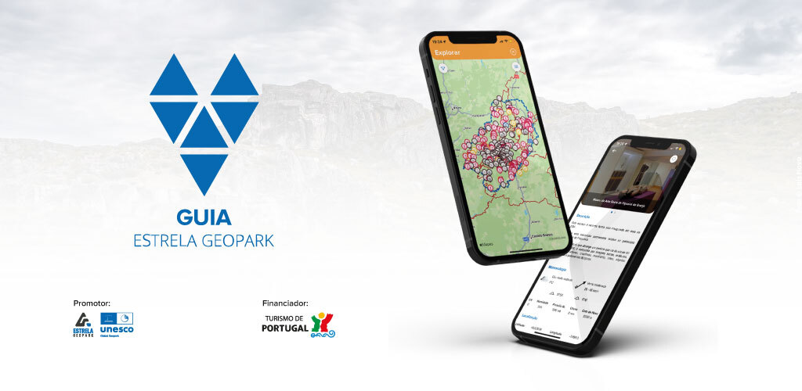

# GUIA - Geopark

A aplicação GUIA permite aos utilizadores explorarem a zona do geoparque estrela através de informação detalhada e imagens de rotas e pontos de interesse. A aplicação também possibilita guardar uma lista de favoritos para consulta posterior e oferece funcionalidades de GPS para que os utilizadores registados possam seguir o caminho certo nas rotas escolhidas.

## Funcionalidades

- Exploração de rotas e pontos de interesse
- Criação e consulta de lista de favoritos
- Uso do dispositivo móvel como GPS para navegação nas rotas escolhidas

## Tecnologias Utilizadas

- **Linguagem:** Kotlin com arquitetura MVVM
- **Layout:** XML

## Layouts e Imagens

  
  

  
  

  
  

  
  

  
  

## Contribuições

Este projeto visa proporcionar uma experiência rica e informativa para os visitantes do Geoparque Estrela, facilitando a exploração e o conhecimento dos pontos de interesse e rotas disponíveis.

## Licença

Este projeto não contém código fonte devido a restrições de propriedade intelectual da empresa anterior.

---

Espero que isto atenda às tuas necessidades! Se precisares de mais alguma alteração ou ajuda, estou à disposição.
